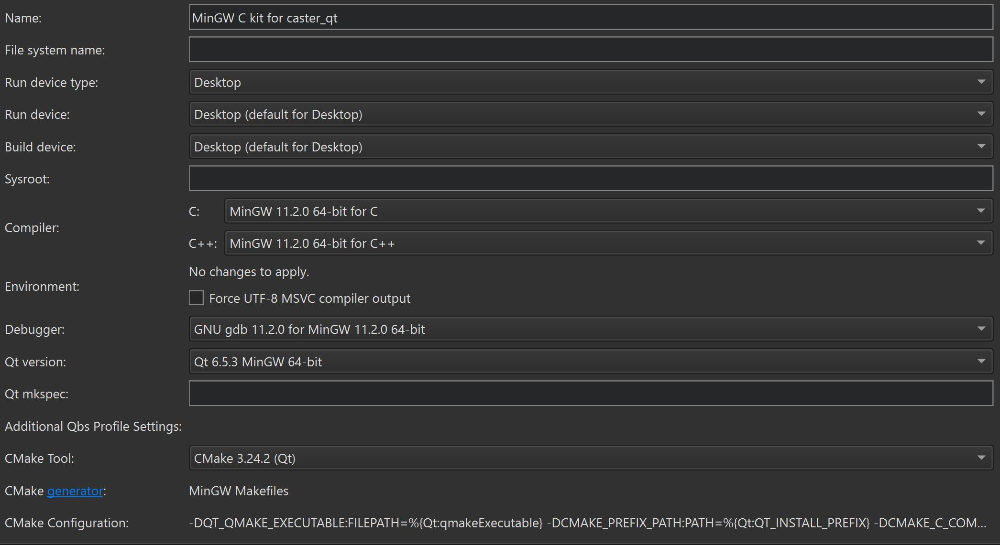
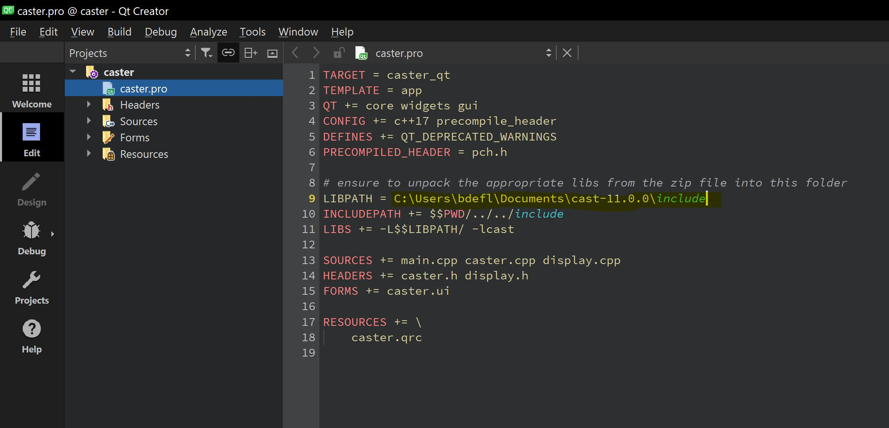

Augmented Reality for Ultrasound Imaging MQP 2023-24
=====================================================

# What's in this folder?
This folder contains the Clarius API version 11.0.0 used for connecting to the Clarius ultrasound probe. It also includes the related files and instructions for successful compilation.

# Requirements

- A valid version of QTCreator must be used to compile this version of the API (Other versions of the API are available here: https://github.com/clariusdev/cast) 

- The version of QTCreator we used is 11.0.3 (QTCreator website: https://www.qt.io/product/development-tools)

- Valid kits are required for compiling within QTCreator as well. Since this API was coded in C & Objective C we must use a C compiler kit as well as make sure the program successfully compiles without errors.

- Finally we need to make sure that the cast.lib file is somewhere that the project file can find. We've included it in the includes folder for ease, you can edit the includes path to be correct for your file structure by opening caster.pro within QT creator and then changing the following line:

# How to run the QT application
Once you've opened the project in QT Creator (open project>navigate to caster_qt>open caster.pro) then you will be prompted to select a kit to compile with. (See kit information above.) Once you've got the correct kit, the cast.lib file is seen by the program, and you've got the project open you should be able to run the project and see the executable run.

# Where's it going?
The current build has a hard-coded directory to save each image to. Within this specified directory the program will read the contents of the folder and determine the next number to assign a group of test images to. The program starts naming folders 1, then 2, so on... 

This is the location you will have to change to your preferred directory path in caster.cpp

# How do I use all of this together?
You must also use the Clarius phone/tablet application in conjunction with this program to begin capturing images. The whole process should go something like this:
1. Open the Clarius App on your phone and power up the scanner.
2. Connect your phone wifi to the signal that the probe will begin to emit, the wifi being emitted will be of the form "DIRECT-##-####". (If the wifi doesn't show up right away you may have to be very patient with the probe, it can fail the connection a few times before it locks in.)
3. Now the probe and the app should be communicating, if you were to begin an exam and press the scanner against skin with ultrasound gel you should see an image on the app. (If it stopped taking images hit the little snowflake button on the app to continue capturing, it times out fast)
4. On the top banner within the app above the image you should see an IP address and a port number. These will be input into the program running on your pc/laptop to connect to the probe.
5. Open QTCreator (mentioned in requirements) and navigate to the caster_qt folder available for download within this repo.
6. Refer to "How to run the QT application" and make sure to change the directory mentioned in "Where's it going?" 
7. Checkpoint! You should now have the application running on your phone, the user interface running on your pc, and the probe connected to your phone. Got it? Good.
8. Now input the IP address and port number mentioned in step 4 into your program on the pc, don't hit connect yet though!
9. Change your pc/laptops wifi to the same "DIRECT-##-####" as your phone, if you still need wifi just plug in an ethernet cable.
10. Go into your pc/laptop settings and disable the firewalls (this is just while you're running the program on your pc) If you don't do this the images won't stream but you'll still connect to the probe.
11. Once you've disabled the firewalls and changed your wifi to the same one as your phone you can hit connect and should see Ultrasound images stream to your pc, as well as download to the folder you specified in previous steps.
12. When done make sure to turn your firewalls back on! 

# Changelog
- Initial writing of readme and upload 11/2 by bmdeflaminio
- Updated caster.cpp to include image download functionality. Also updated instructions to be more thorough and to explain the new functionality 11/20 by bmdeflaminio
